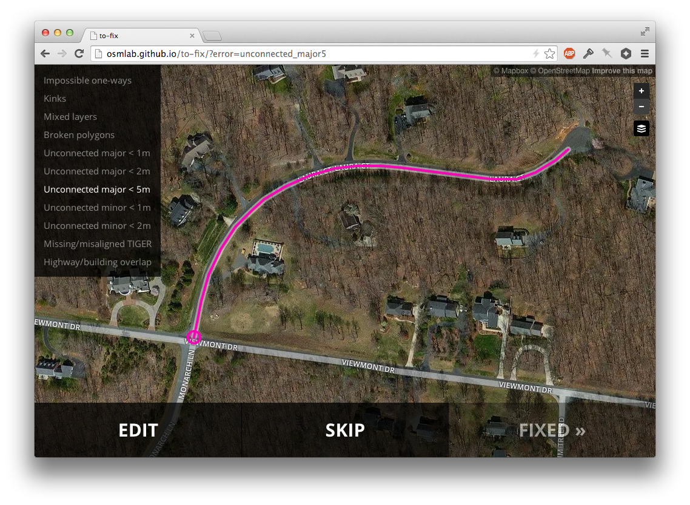

##to-fix - map tasking



### Frontend

The frontend is a static application. The JavaScript portion is built with
`browserify` and can be updated as follows:

```sh
$ npm install
$ npm start
```

This will rebuild JS, CSS, and serve on port 3000.
